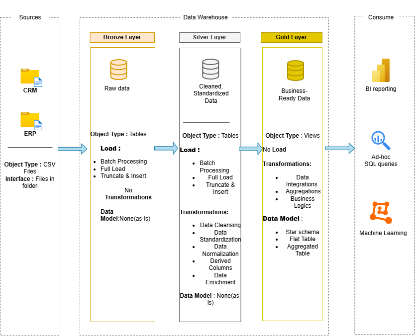

# Data Warehouse and Analytics Project

This repository presents an end-to-end **Data Warehouse and Analytics solution** built using SQL Server.  
The project demonstrates modern data engineering and analytics practices, including data ingestion, transformation, modeling, and reporting for business insights.

---

## 📌 Project Overview

The objective of this project is to design and implement a scalable data warehouse that consolidates sales data from multiple sources and enables analytical reporting and decision-making.

Key components include:

- Data warehouse architecture design
- ETL pipeline development
- Data modeling using star schema
- SQL-based analytics and reporting

---

## 🏗️ Data Architecture

The project follows the **Medallion Architecture** consisting of three layers:

### Bronze Layer
- Stores raw data ingested from CSV source systems.
- Data is loaded into SQL Server without modification.

### Silver Layer
- Performs data cleansing, standardization, and transformation.
- Ensures data quality and consistency.

### Gold Layer
- Contains business-ready datasets.
- Implements star schema models optimized for analytics and reporting.

---

## 🎯 Project Objectives

- Build a modern data warehouse using SQL Server
- Integrate ERP and CRM datasets
- Clean and transform raw data
- Create analytical data models
- Generate business insights using SQL queries

---

## 🛠 Tools & Technologies

- SQL Server Express
- SQL Server Management Studio (SSMS)
- T-SQL
- Data Warehousing Concepts
- ETL Processes
- Draw.io (Architecture & Data Modeling)

---

## 📋 Project Requirements

### Data Engineering
- Import data from ERP and CRM CSV sources
- Resolve data quality issues before analysis
- Integrate datasets into a unified analytical model
- Document data models for analytics usage

### Analytics & Reporting
Develop SQL-based analysis to provide insights into:

- Customer behavior
- Product performance
- Sales trends
- Business KPIs

Additional details are available in:
`docs/requirements.md`

---

## ⚙️ Project Workflow

1. Data Ingestion (CSV → SQL Server)
2. Data Cleaning & Transformation
3. Data Modeling (Fact & Dimension Tables)
4. Data Warehouse Development
5. Analytical Querying & Reporting

---

## 📊 Analytics & Reporting

The warehouse enables analysis such as:

- Sales performance trends
- Customer segmentation
- Product category analysis
- Revenue and KPI reporting

---

## 📂 Repository Structure
data-warehouse-project/
│
├── datasets/ # Source datasets (ERP & CRM)
├── docs/ # Architecture and documentation files
├── scripts/
│ ├── bronze/ # Raw data loading scripts
│ ├── silver/ # Data transformation scripts
│ └── gold/ # Analytical model scripts
├── tests/ # Data validation scripts
├── README.md
├── LICENSE
├── .gitignore
└── requirements.txt

---

## 🛡️ License

This project is licensed under the MIT License.  
You are free to use, modify, and distribute this project with proper attribution.

---

## 👤 About Me

Hi, I'm **Kiran J**, a Data Analyst enthusiast with a Mechanical Engineering background, focused on building real-world data analytics and data warehouse solutions.

**Skills & Interests**
- SQL & Data Warehousing
- Data Cleaning & Transformation
- Data Modeling
- Analytics & Reporting
- Business Data Analysis

I am actively developing portfolio projects that demonstrate end-to-end data analytics workflows and business insight generation.

📫 Connect with me:
- LinkedIn: www.linkedin.com/in/kiran-j-dataanalyst
- GitHub: 
